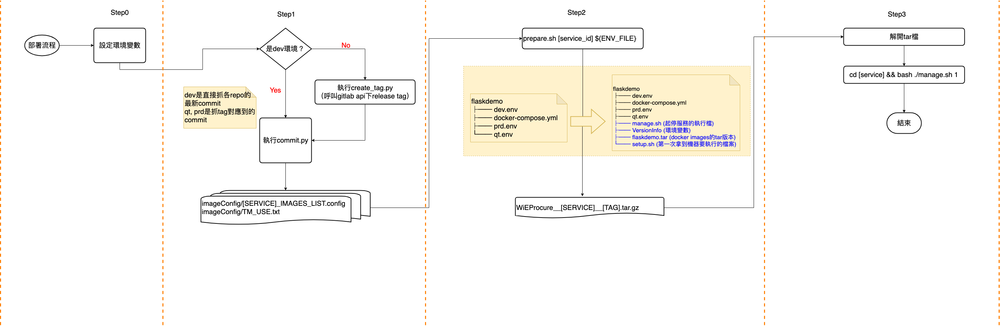
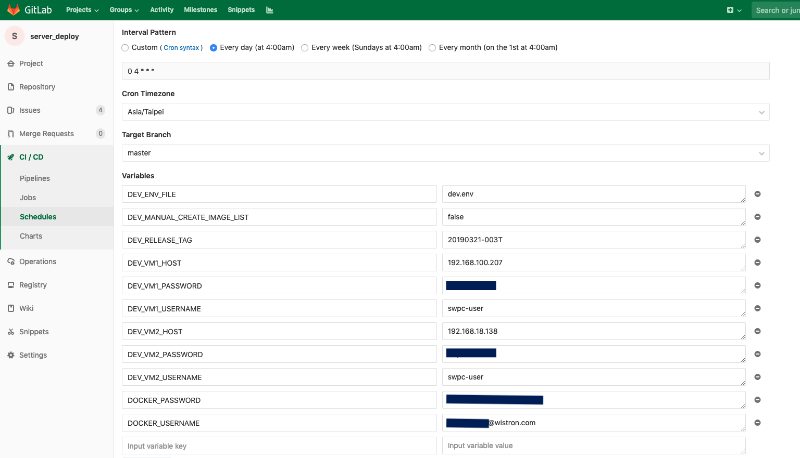
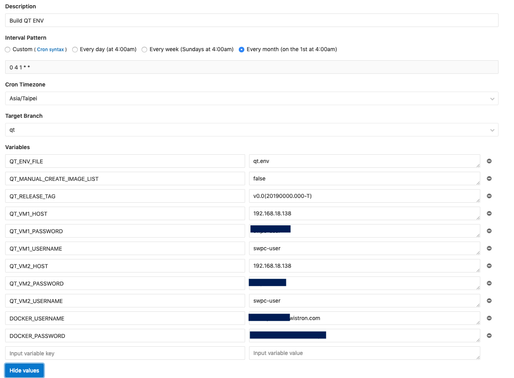
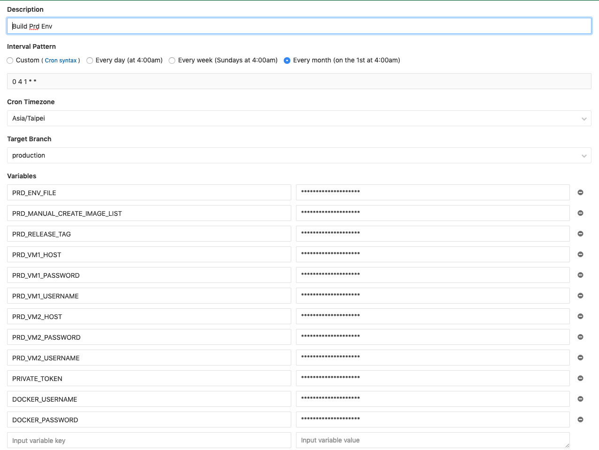

## 部署QT和PRD要做的事

先確定qt和production的branch的code是最新的    
把gitlab cicd schedule的變數改好(尤其是版號，如果要上的是`v2.0(190329.004-T) `，那就下`v2.0(190329.004-T)`)    
執行 `./findDockerImgHelper/create_tag.py`去每個repo下tag     (要下對版號，和token)

```
export RELEASE_TAG=v2.0(190511.009-T)
export PRIVATE_TOKEN=[gitlab token]
```

---

## 使用CICD之前

- 要建立使用者`swpc-user`    
- 要執行`setup.sh`

`setup.sh`在一開始拿到機器的時候就要執行，之後CICD就不執行了。    
執行方式 `bash setup.sh ${VM_PASSWORD}`

- web的那台要把ssl放好
把`ssl裡面的所有憑證`都放到`/etc/ssl/`裡面

`cp ssl/* /etc/ssl/`

- web那台要設定ga的檔案

**WiEProcureV/ga/ga-use.js** 
```js
// dev, sit, prd
window.GLOBAL_GA_ENV = 'dev';
console.log('here is for ga');
```

- pipe那台要裝zip

```
sudo yum install zip
```

--- 

## 部署的流程概要

### Step0: 設定環境變數

```bash
export RELEASE_TAG=2019demo
export ENV_FILE=dev.env
export PRIVATE_TOKEN=[gitlab設定的token]

# [optional] 這是特別為了部署master branch設計的，如果沒有給就預設使用release branch部署
export SWITCH_WEB_BRANCH=master
```

### Step1: `python ./findDockerImgHelper/commit.py`先根據環境產生`[SERVICE]_IMAGES_LIST.config`    

dev環境可以直接執行`./findDockerImgHelper/commit.py`    
qt和prd要先執行 `./findDockerImgHelper/create_tag.py`去每個repo下tag     
(dev是直接抓各repo的最新commit，qt, prd是抓tag對應到的commit)

這個步驟會根據服務產生docker images的id資訊，以及一個`TM_USE.txt`描述所有的docker images和版號以及環境

```
imageConfig
├── DB_IMAGES_LIST.config
├── FLASKDEMO_CONFIG_PATH.config (DEBUG=True才會產生)
├── PIPE_IMAGES_LIST.
├── SYNC_IMAGES_LIST.config
├── TM_USE.txt
└── WEBAPP_IMAGES_LIST.config
```

### Step2: 把service成一個tar檔(裡面有docker images tar, 環境變數)

```bash
bash prepare.sh 4 ${ENV_FILE}
```

一個基本的服務裡面的檔案結構如下：    

```
 flaskdemo
├── dev.env
├── docker-compose.yml
├── prd.env
└── qt.env
```

`prepare.sh`執行過後會多出幾個檔案：    

```
flaskdemo
├── dev.env
├── docker-compose.yml
├── prd.env
├── qt.env
├── manage.sh (起停服務的執行檔)
├── VersionInfo (環境變數)
├── flaskdemo.tar (docker images的tar版本)
└── setup.sh (第一次拿到機器要執行的檔案)
```


### Step3. 測試剛剛包出來的tar檔可不可以安裝
根據上面的環境變數，包出來的tar是`WiEProcure__flaskdemo__2019demo.tar`，我們先移到另一個資料夾測試，解tar出來才不會影響到原本的source code     

解tar檔後，啟動服務的方法是

```
➜  cd flaskdemo 
➜  bash ./manage.sh 1
```

**示意圖**



## CICD 要設定
上面提供的是大概部署的flow，真正在跑CICD的時候還要設定部署的路徑、也會在部署完成後執行`clean_old_files.sh`把機器裡上次部署過的檔案刪掉(參見.gitlab-ci.yml的deploy_script_template部分)     

環境變數的地方要設定    

**共用的**

PRIVATE_TOKEN - gitlabAPI設定的token
DOCKER_USERNAME - OA信箱     
DOCKER_PASSWORD - OA密碼     

**DEV**
DEV環境還有一個optional的參數可以設定，因為有時候想看master部署的結果，所以特別加一個可以從CICD控制的參數
DEV_SWITCH_WEB_BRANCH - [master|release]

DEV_ENV_FILE - dev.env(吃dev.env的環境變數)    
DEV_MANUAL_CREATE_IMAGE_LIST - 是否使用手動上傳的檔案，預設是false     
DEV_RELEASE_TAG - 要release的版號     
DOCKER_USERNAME - OA信箱     
DOCKER_PASSWORD - OA密碼     
DEV_BUILD_OFFLINE_DOCKER_TARS - [true|false] 不帶此參數就是false。是否打包離線版的docker(如果vm沒有網路的時候也可以順利安裝)



**QT** 
QT_ENV_FILE - qt.env   (吃qt.env的環境變數)    
基本上把前面圖片的變數，DEV都改成QT

**QT_SWITCH_WEB_BRANCH 建議不要設定，不要設定就是release**
QT_SWITCH_WEB_BRANCH - [master|release] 
QT_BUILD_OFFLINE_DOCKER_TARS - [true|false] 不帶此參數就是false。是否打包離線版的docker(如果vm沒有網路的時候也可以順利安裝)



**PRD**
PRD_ENV_FILE - prd.env   (吃prd.env的環境變數)    
基本上把前面圖片的變數，DEV都改成PRD    

**PRD_SWITCH_WEB_BRANCH 建議不要設定，不要設定就是release**
PRD_SWITCH_WEB_BRANCH - [master|release] 
PRD_BUILD_OFFLINE_DOCKER_TARS - [true|false] 不帶此參數就是false。是否打包離線版的docker(如果vm沒有網路的時候也可以順利安裝)


---

# 遇到幾個問題

## 關於跳脫

<!-- 參考： https://askubuntu.com/questions/372926/bash-syntax-error-near-unexpected-token -->
一種是加引號"2019v0.0_(20190321-T)"
另一種方式就是自己跳 2019v0.0_\(20190321-T\)

RELEASE_TAG有可能有括號，如果有括號，在執行shell時候都要跳脫，跳脫的方式可以加引號處理
所以CICD關於RELEASE_TAG都加了引號\"${RELEASE_TAG}\"


## 關於manage.sh

如果有改到環境變數的話，要使用`sh manage.sh 3`(up -d)。如果用`sh manage.sh 4`(restart)的話會一直吃不到新的環境變數    


## Delete local tags that do not exist in remote 

```
git fetch --prune origin "+refs/tags/*:refs/tags/*"
```

## docker-compose: error while loading shared libraries: libz.so.1: failed to map segment from shared object: Operation not permitted

```
sudo mount /tmp -o remount,exec
```